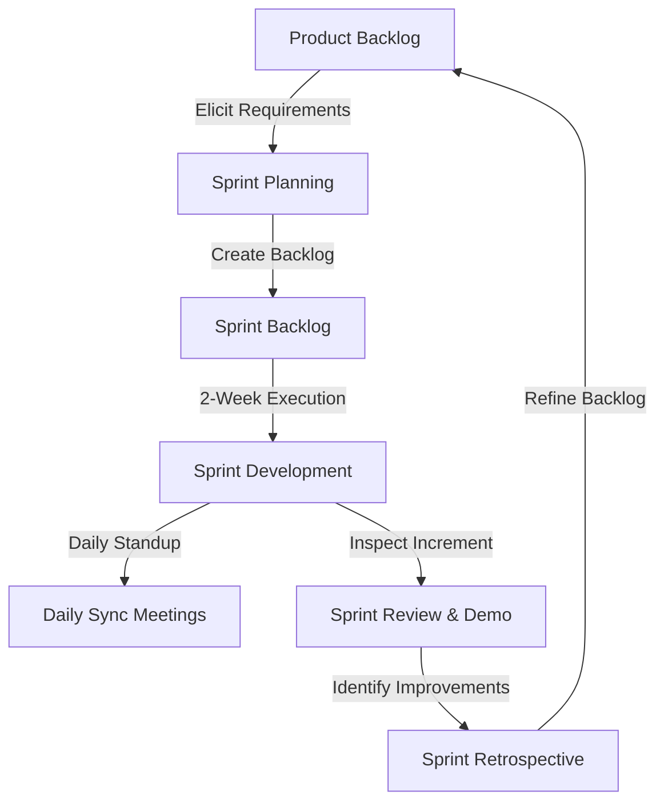
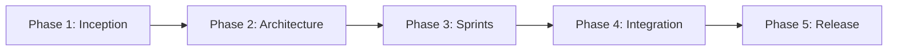
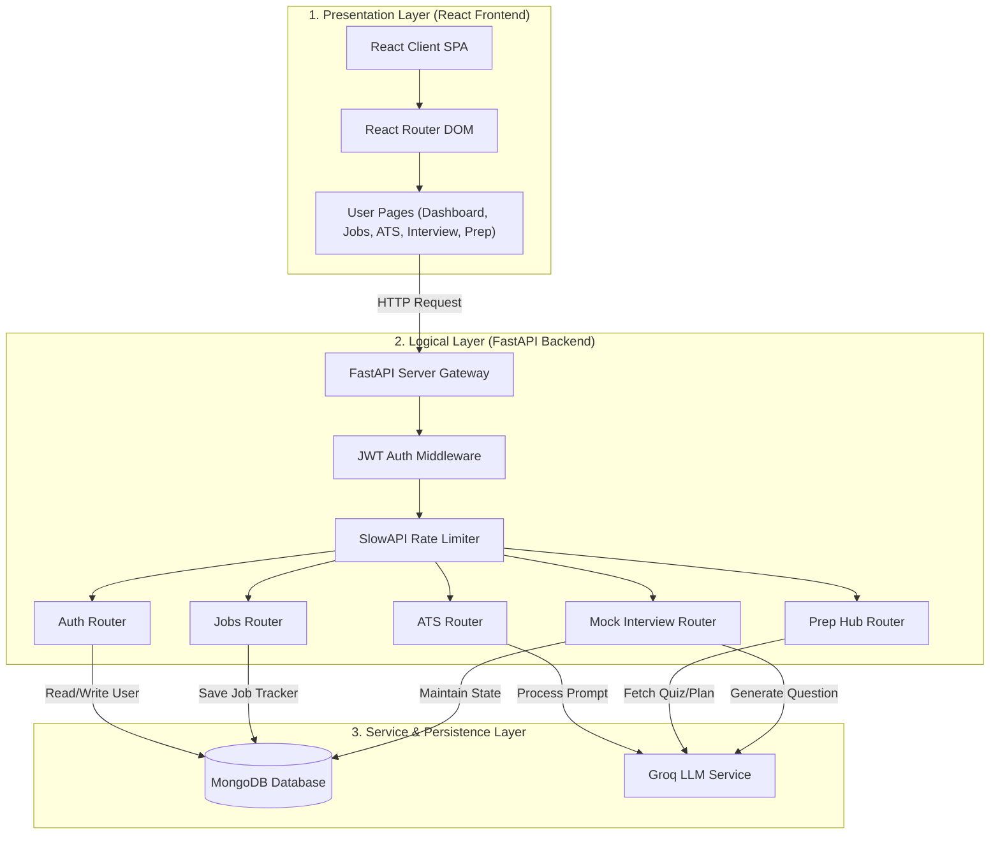
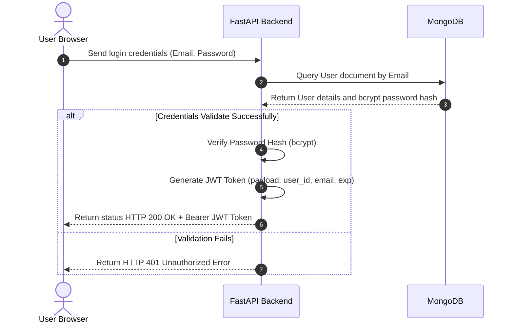
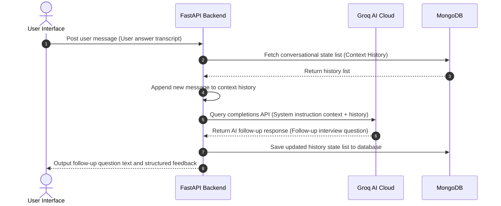

# B.Tech Final Year Project Report
## Job Career – AI-Based Career Guidance and Job Portal

---

## Abstract

In the modern digital economy, finding relevant employment and preparing for interviews is highly fragmented. Candidates are forced to navigate multiple corporate job boards (LinkedIn, Indeed, Naukri, Wellfound) and government portals (UPSC, SSC, RRB, IBPS), while simultaneously relying on disconnected tools for resume formatting, Applicant Tracking System (ATS) checks, skill gap analysis, quiz practices, and mock interview preparations. 

This report presents **Job Career (CareerPilot)**, an AI-driven, unified career guidance and job aggregation platform. The application acts as a single access hub by indexing external platforms and using advanced Natural Language Processing (NLP) models to provide automated placement preparation. The core of the portal is built around a FastAPI Python backend, a React-Vite frontend, and a MongoDB Atlas database. AI functions are powered by Groq AI's `llama-3.3-70b-versatile` model, delivering low-latency mock interview turn agents, ATS scoring pipelines, study planners, and practice quizzes. 

This document details the Software Development Life Cycle (SDLC) of the project, including scope definition, Agile planning, system architecture, database schema configurations, flowcharts, implementation code segments, testing matrixes, and deployment guidelines.

---

## Contents
1. **Introduction**
   - 1.1 Problem Domain
   - 1.2 Related Studies
2. **Problem Definition**
   - 2.1 Scope
   - 2.2 Exclusions
   - 2.3 Assumptions
3. **Project Planning**
   - 3.1 Software Development Life Cycle Model
   - 3.2 Scheduling
   - 3.3 Cost Analysis
4. **Requirement Analysis**
   - 4.1 Requirement Matrix
   - 4.2 Requirement Elaboration
5. **Design**
   - 5.1 Technical Environment
   - 5.2 Detailed Design (Architecture, Class Diagrams, Flowcharts)
6. **Implementation**
   - 6.1 Implementation Details & Code Snippets
   - 6.2 System Installation Steps
   - 6.3 System Usage Instructions
7. **Test Results and Analysis**
   - 7.1 Test Plan & Cases
   - 7.2 Analysis & Metrics
8. **Conclusion**
   - 8.1 Project Benefits
   - 8.2 Future Scope
9. **References**
10. **Appendix & Glossary**

---

## 1. Introduction

The transition of the global employment ecosystem from physical notice boards and newspaper advertisements to modern digital recruitment platforms has fundamentally changed how jobseekers discover career opportunities. Despite this digitalization, the job search process remains highly fragmented. Candidates are forced to monitor multiple corporate job boards, startup lists, freelancing platforms, and isolated public sector notification websites daily to avoid missing critical openings. This separation of job boards from preparation hubs creates a significant operational disconnect, forcing candidates to use different, often expensive, third-party services for resume building, mock interviews, and exam preparation.

Furthermore, the widespread adoption of Applicant Tracking Systems (ATS) has introduced a filter where algorithms screen resumes based on structural and keyword parsing before they are ever viewed by a human recruiter. Without direct feedback or keyword validation tools, qualified jobseekers frequently have their applications rejected simply due to layout incompatibility or minor formatting discrepancies. Job Career (CareerPilot) addresses these combined challenges by establishing an AI-powered, unified job aggregator and placement preparation system. By indexing external job resources into a centralized, responsive catalog, and leveraging Groq AI’s completions engines, the platform offers automated ATS scoring, customized practice tests, learning roadmaps, and interactive mock interviews in a single application.

### 1.1 Problem Domain
The problem domain lies at the intersection of **Information Retrieval (Job Aggregation)** and **Natural Language Processing (AI Career Guidance)**. 

From an information retrieval perspective, the system indexes job sources to let candidates search both private corporate roles and public sector notices in one click. 

From an NLP perspective, the application uses AI to parse resumes (extracting skills, experience, and contact details from PDFs) and analyze them against target job descriptions. The system generates an ATS match score and lists specific skill gaps. Additionally, it offers a study plan generator and logical reasoning quizzes to help candidates address those gaps. Finally, a conversational mock interviewer provides real-time technical and HR interview practice with detailed text-based evaluation.

### 1.2 Proposed System Objectives
The main objectives of the Job Career platform are:
1. **Consolidated Indexing**: Integrate diverse platforms (LinkedIn, Naukri, Indeed, Upwork, UPSC, SSC, RRB) into a single search catalog.
2. **Resume Analysis**: Develop a parser to evaluate resumes against job descriptions, calculating an ATS score and identifying missing skills.
3. **Structured Study Planning**: Generate custom learning timelines and logical reasoning practice quizzes.
4. **Mock Interview Simulation**: Simulate technical and HR interview rounds with real-time feedback using Groq AI.
5. **Application Tracking**: Build a dashboard to help users track application deadlines and progress.

### 1.3 Related Studies & Literature Review

To evaluate the structural position and practical necessity of the Job Career portal within the current job search market, we conducted a literature review of existing systems, categorizing them into three primary models: commercial job boards, standalone resume screening utilities, and independent AI simulation tools. Commercial platforms, such as LinkedIn, Indeed, and Naukri, serve as large global job repositories. While they excel at listing vacancies and enabling candidate-recruiter interactions, they do not provide automated tools to optimize resumes or prepare for interviews. This leaves jobseekers to navigate the selection criteria without guidance.

On the other hand, standalone resume scoring services like Jobscan and ResumeWorded offer analysis by checking resumes against specific job descriptions. However, these utilities operate on subscription-based business models, making them inaccessible to many students and entry-level candidates. Furthermore, they are disconnected from job search boards, requiring candidates to manually copy descriptions back and forth between sites. Similarly, AI mock interview systems like Interviewing.io or speech analysis applications provide interview practice, but they are expensive, specialized services that do not align with the candidate's active job search applications or skill-gap evaluations. 

By analyzing these models, we identified a clear gap: the lack of a unified, free portal that connects the job aggregation index directly with AI-driven resume scoring, targeted logic quizzes, study planning, and real-time mock interviews. Job Career bridges this gap, consolidating resources and preparation tools into a single, accessible system.

## 2. Problem Definition

The main problem this project addresses is the lack of guidance and consolidation in online career recruitment. Jobseekers face a complex job market without tools to optimize their profiles or practice for interviews. The Job Career platform addresses this by providing a unified portal that combines search aggregation with interactive AI preparation tools. The scope, boundaries, and underlying constraints of the system are defined below.

### 2.1 Scope
The project scope covers the design, development, database design, and testing of the Job Career web application. The functional boundaries are structured into the following modules:
- **Direct Aggregator & Search Indexer**: Indexes leading private job boards (LinkedIn, Indeed, Naukri, Foundit, Wellfound) and official Indian government portals (UPSC, SSC, RRB, IBPS), enabling candidates to filter and launch custom queries across multiple sites in a single interface.
- **AI Resume Parser & ATS Score Checker**: Extracts text from uploaded PDF resumes, compares it against a target job description, calculates a match score (0 to 100), and outputs matching skills, missing keywords, and structural recommendations.
- **Mock Interview Simulator**: Acts as a conversational interviewer using FastAPI and Groq AI to generate progressive technical/HR questions and structured textual feedback.
- **Placement Preparation Hub & Quiz Engine**: Generates week-by-week study roadmaps and customized multiple-choice practice quizzes at user-selected difficulty levels.
- **Centralized Application Tracker**: A personalized user dashboard to save aggregated listings and monitor application progress (Applied, Shortlisted, Interviewing, Offered, Rejected) alongside exam deadlines.

### 2.2 Exclusions
To maintain project focus, manage infrastructure limits, and ensure system security, several operational capabilities are excluded from the development scope:
- **Internal Job Listings**: The platform aggregates external platforms and does not host original job listings or allow employers to post vacancies directly.
- **Direct Application Processing**: CareerPilot redirects users to the official external URLs to complete their submissions instead of processing applications directly.
- **Employer Screening Interface**: The platform acts strictly as a candidate-side tool and excludes recruiter-facing applicant dashboards.
- **Payment Gateway Processing**: The system is designed as a free career guidance and educational resource and does not process financial transactions.

### 2.3 Assumptions
The implementation and runtime stability of the system depend on the following technical assumptions:
- **Groq API Cloud Availability**: We assume continuous availability and stable latency of the Groq completions endpoint for the `llama-3.3-70b-versatile` model.
- **PDF Resume Vector Formats**: Uploaded resumes are assumed to be standard, text-based PDF files conforming to vector format standards, as scanned raster images are not supported.
- **Browser API Compatibility**: Users access the portal using modern web browsers supporting HTML5, CSS3, and ES6+ to render the interactive React user interface.
- **Network and Persistence Infrastructure**: We assume a stable network connection capable of handling concurrent REST API requests and secure JWT header validation, alongside high uptime for the MongoDB database cluster.

---

## 3. Project Planning

### 3.1 Software Development Life Cycle Model

The development of the Job Career web portal followed the **Agile Scrum** methodology. Traditional SDLC models (such as the linear Waterfall model) require rigid requirements and do not easily allow for changes during development. However, developing an AI-integrated application (which uses LLM prompt engineering, dynamic backend APIs, and database syncs) requires regular prototyping, prompt refinement, and user interface updates.

Scrum was selected to structure the project into two-week iterations called Sprints. This allowed us to continuously verify features, optimize Groq API prompts, and adjust UI layouts.

#### 3.1.1 Scrum Lifecycle Framework



#### 3.1.2 SDLC Execution Phases

The execution of the SDLC was divided into five distinct phases, mapping directly to our Sprint schedule:



1. **Inception & Requirements Elicitation (Sprint 1)**: In this phase, we defined the user stories for candidate onboarding, ATS evaluation, and interview preparation. We also analyzed the feasibility of using the Groq API and set up the basic project repository.
2. **System Architecture & Database Modeling (Sprint 2)**: We designed the system's asynchronous REST architecture. This included designing the MongoDB collections schema and setting up FastAPI routers to handle user profiles and application tracker logs.
3. **Iterative Sprint Development (Sprints 3-4)**:
   - **Sprint 3 (AI Core)**: Built the PDF resume text extraction pipeline using `pdfplumber` and set up the Groq prompt templates for calculations.
   - **Sprint 4 (Interactive Features)**: Implemented the conversation turn manager in MongoDB and configured the interview response evaluator. We also built the study planner and practice quiz controllers.
4. **Integration & Refactoring (Sprint 5)**: Connected the React single-page frontend to the backend REST controllers, refactored CSS styling to ensure consistent light-theme visuals, and set up reCAPTCHA verification.
5. **Deployment & CI/CD Release**: Structured the root `vercel.json` config for multi-service hosting, set up production environment secrets, and deployed the live project.

### 3.2 Scheduling
The project was executed across five primary milestones, each mapping to a two-week develop-and-release iteration cycle. The chronological timeline, including technical tasks, deliverables, and validation checkpoints, is detailed below.

#### Milestone 1: Requirement Specification & System Design (Weeks 1-2)
- **Technical Tasks**: Gathering user stories for onboarding, tracker, and AI preparation hub modules; mapping standard database entities; conducting feasibility evaluations on the Groq completions endpoint; configuring git project repositories.
- **Deliverables**: Detailed software requirements document, UML database schema map, indexing validation routines, and basic monorepo workspace configuration.
- **Validation**: Project design review sign-off and verification of database index definitions.

#### Milestone 2: Secure Session Management & Job Directory API (Weeks 3-4)
- **Technical Tasks**: Writing registration and login routers; implementing password hashing logic using `bcrypt`; designing JWT token encryption and header validation filters; indexing public government boards and private aggregator links.
- **Deliverables**: Backend routes (`/auth/register`, `/auth/login`, `/jobs/`), custom CORS configurations, database models, and token verification middlewares.
- **Validation**: Postman unit testing of registration constraints and verification of catalog search response speed.

#### Milestone 3: Asynchronous AI Parser & ATS Scorer Pipeline (Weeks 5-6)
- **Technical Tasks**: Writing PDF text reader script components; writing resume evaluations system prompts; setting up `httpx` async Groq completions connectors; configuring JSON formatting rules.
- **Deliverables**: Resumes parsing routes (`/ats/analyze`), Groq template query tools, and JSON parser adapters.
- **Validation**: Testing pdfplumber text extraction against multi-column formats and verifying Groq response parsing.

#### Milestone 4: Conversational Interview Agent & Prep Quiz Engine (Weeks 7-8)
- **Technical Tasks**: Building interview state routers; writing system prompts for interviewer turns; implementing response evaluations logic controllers; designing practice quiz generators.
- **Deliverables**: Interview endpoints (`/interview/start`, `/interview/turn`), quiz generation routines (`/prep/quiz`), and roadmaps adapters (`/prep/roadmap`).
- **Validation**: Conversational turn testing in database and verification of quiz choices formatting.

#### Milestone 5: Frontend Layout Client, Quality Assurance & Live Launch (Weeks 9-10)
- **Technical Tasks**: Linking React pages to backend routes using Axios; managing state for login and tracking tables; writing CSS rules for theme overrides; deploying the project on Vercel.
- **Deliverables**: Complete React client build, custom CSS stylesheet overrides, Google reCAPTCHA forms security, root `vercel.json` routing configuration, and live URL deployments.
- **Validation**: Verification of build compilation, page load performance analysis, and security verification.

---

### 3.3 Cost Analysis

#### 3.3.1 Infrastructure Component Projections
The initial operational phase of the portal uses a free cloud tier configuration:

| Infrastructure Service | Vendor / Model | Tier / Performance Spec | Monthly Cost |
| :--- | :--- | :--- | :--- |
| **Monorepo Hosting** | Vercel Cloud | Hobby Tier / Multi-service monorepo configuration | $0.00 / month |
| **NoSQL Database** | MongoDB Atlas | M0 Shared Cluster / 512MB Storage / Asynchronous Motor access | $0.00 / month |
| **Verification Shield** | Google reCAPTCHA | v2 Checkbox & v3 Admin Console / Up to 1M requests/month | $0.00 / month |
| **Domain Registration** | Porkbun Registrar | Custom `.com` or `.org` TLD mapping | ~$1.00 / month |

#### 3.3.2 AI Inference Token Math (Groq Cloud API)
The operational model uses Groq's Llama 3.3 70B model. The cost calculations per user interaction are detailed below:

##### 1. ATS Scoring Pipeline Turn:
- **Input Prompt (Job Description + Parsed PDF Text + Format Rules)**: ~4,000 tokens. Cost: `4,000 * ($0.59 / 1,000,000) = $0.00236`.
- **Output Response (JSON matches list + skill gaps + suggestions)**: ~1,000 tokens. Cost: `1,000 * ($0.79 / 1,000,000) = $0.00079`.
- **Total ATS Run Cost**: `$0.00315` per run.

##### 2. Conversational Mock Interview Turn (Average 10-turn round):
- **Cumulative Input Prompts (System guidelines + conversation history)**: ~15,000 tokens. Cost: `15,000 * ($0.59 / 1,000,000) = $0.00885`.
- **Cumulative Output Responses (AI follow-up question texts)**: ~2,500 tokens. Cost: `2,500 * ($0.79 / 1,000,000) = $0.001975`.
- **Total Interview Cost**: `$0.010825` per interview.

##### 3. Monthly Operational Scaling Projection (10,000 Active Users):
Assuming a monthly user base of 10,000 users executing 20,000 ATS parses, 10,000 mock interviews, and 30,000 preparation quizzes, the total projected monthly API cost is:
- **ATS Runs**: `20,000 * $0.00315 = $63.00`
- **Interview Rounds**: `10,000 * $0.010825 = $108.25`
- **Quizzes & Plans**: `30,000 * $0.00150 = $45.00`
- **Total Monthly Operational Cost**: **$216.25** (providing a cost-efficient career guidance portal).

---

## 4. Requirement Analysis

The requirement analysis phase serves as the foundation for the software engineering lifecycle of the Job Career web portal. It translates user needs into clear technical specifications, ensuring a clean link between the user interface and the backend logic. The main goal of this analysis is to define both functional features (such as user session management, job search aggregation, resume scoring, study roadmaps, and mock interviews) and non-functional goals (such as system security, sub-150ms response times, cross-device compatibility, and input validations). By analyzing these requirements, we established a structured priority index and estimated story points, creating a development blueprint that balances engineering feasibility with user needs.

### 4.1 Requirement Matrix

| Req ID | Target Module | Priority | Story Points | Description |
| :--- | :--- | :--- | :--- | :--- |
| **R-AUTH-1** | User Auth | High | 3 | Users must be able to register secure accounts using password hashing (bcrypt). |
| **R-AUTH-2** | User Auth | High | 2 | Secure user login must issue JSON Web Tokens (JWT) for route authorization. |
| **R-AUTH-3** | User Auth | High | 4 | Users must be able to securely recover/reset their passwords using verification codes (OTP). |
| **R-JOBS-1** | Aggregator | High | 5 | The system must catalog and display external private and public job portals. |
| **R-ATS-1**  | ATS Tool | High | 8 | The portal must parse PDF resumes and generate matching scores against job descriptions. |
| **R-ATS-2**  | ATS Tool | High | 3 | The parser must identify skill gaps and provide optimization recommendations. |
| **R-PREP-1** | Prep Hub | Medium | 5 | The system must generate custom study plans based on career topics and difficulty. |
| **R-PREP-2** | Prep Hub | Medium | 8 | The portal must build customized practice quizzes on topics like Logical Reasoning. |
| **R-INT-1**  | Interview | High | 13 | The simulator must run interactive mock interview sessions with structured text feedback. |
| **R-TRACK-1**| Tracker | Medium | 5 | Users must be able to save external listings and track their application progress. |
| **R-SEC-1**  | Security | High | 5 | Forms must be protected against automated spam bots using Google reCAPTCHA validation. |
| **R-PERF-1** | Operations | High | 3 | The system must handle multiple concurrent user queries and API requests asynchronously. |

### 4.2 Requirement Elaboration

Requirement elaboration is the process of expanding the high-level user stories defined in the requirement matrix into detailed technical specifications. The primary purpose of this elaboration is to define how the system behaves under different scenarios, establishing clear boundaries for developers. By breaking down the software's objectives, we separate them into two main areas: functional requirements, which outline the direct features and interactive behaviors of the portal (such as session controls, resume extraction, and mock interview simulation), and non-functional requirements, which specify the system's operational standards, security parameters, execution performance, and target platform compatibilities.

#### 4.2.1 Functional Requirements
Functional requirements define the core operational features of the Job Career portal. The system must provide a secure user authentication pipeline that validates user credentials, hashes passwords using bcrypt, and issues JSON Web Tokens (JWT) to authorize subsequent API requests. The platform aggregator must index external job portals, categorize them into private, government, and internship portals, and render clickable redirection links. For profile optimization, the backend must support resume text extraction from uploaded PDF documents, perform structured keyword matching against user-provided job descriptions, calculate an overall match score, and output list suggestions for missing skills.

In addition, the preparation hub must generate customized study plans based on career path settings and build practice quizzes on selected topics with instant scoring. Finally, the mock interview engine must run conversational interview sessions, tracking conversation state history in MongoDB, generating follow-up questions via Groq, and rendering real-time structured text feedback.

#### 4.2.2 Non-Functional Requirements
Non-functional requirements specify the quality attributes and technical constraints of the system. In terms of security, the platform must enforce secure session management by guarding private routes with JWT verification headers, encrypting database passwords, and validating form submissions using Google reCAPTCHA. Performance requirements specify that database queries must execute in under 150ms, while high-latency Groq AI operations must execute asynchronously to prevent blocking the main server threads.

Usability requirements focus on a responsive, accessible interface. The design must scale across different device screens and maintain high text visibility using clear color tokens. Finally, reliability requirements dictate that the system must handle API and database connection dropouts gracefully, validating all user inputs to prevent server-side errors and runtime application crashes.

---

## 5. Design

The design phase translates software requirements into a conceptual and structural architecture. The main objective of this phase is to define the technical environment, database schemas, component structures, and sequence pipelines of the Job Career web portal. It begins with establishing the technical environment, detailing the specific frameworks, compiler environments, database engines, and runtime libraries used in development. It then details the overall system architecture through structured 3-tier component diagrams, maps NoSQL database models for persistent collections, and visualizes system execution paths using sequence diagrams for key user interactions (such as secure authentication, ATS parsing, and mock interview conversational turns).

### 5.1 Technical Environment
The development and runtime environments use a modern, asynchronous JavaScript and Python stack:
- **Frontend Stack**:
  - **React (v18.3)**: A JavaScript library for building single-page user interfaces.
  - **Vite (v8.0)**: A build tool that handles fast module hot reloading during development and optimizes assets for production.
  - **Tailwind CSS (v3.4)**: A utility-first CSS framework used for responsive layout design.
  - **Axios (v1.7)**: A promise-based HTTP client used to manage asynchronous requests to backend endpoints.
  - **Lucide React & FontAwesome**: Libraries providing UI icons.
- **Backend Stack**:
  - **FastAPI (v0.136)**: A modern web framework for building APIs with Python 3.11+, using standard type hints and `asyncio`.
  - **Uvicorn (v0.49)**: An ASGI web server implementation for running Python web apps.
  - **Pydantic (v2.13)**: Data validation and settings management using Python type annotations.
  - **Motor (v3.7)**: An asynchronous Python driver for MongoDB.
  - **Python-Jose (v3.5) & Passlib (v1.7) & Bcrypt (v4.0)**: Encryption libraries used to secure routes with JWT tokens and hash passwords.
  - **PDFPlumber (v0.11)**: A PDF text extraction library.
  - **Httpx (v0.28)**: An asynchronous HTTP client for Python used to query the Groq completions endpoint.
  - **SlowAPI (v0.1)**: A rate-limiting library for FastAPI.
- **Database Layer**:
  - **MongoDB Atlas**: A cloud-hosted NoSQL database storing user metadata, tracker items, and preparation history.

---

### 5.2 Detailed Design

Detailed design represents the structural blueprint of the application, translating conceptual layers into concrete execution maps. The main goal of this section is to detail the internal configurations, data schemas, and sequence flowcharts of the Job Career web portal. It begins with establishing the overall system architecture, mapping how presentation, business logic, and database services communicate. It then presents NoSQL database schemas to define how profiles, tracker histories, and preparation logs are stored. Finally, it uses sequence flowcharts to model the exact runtime steps for critical system pipelines, including secure user login cycles, multi-column PDF resume parsers, and mock interview conversational turn loops.

#### 5.2.1 Overall System Architecture
The portal follows a 3-Tier Client-Server Monorepo Architecture:



---

#### 5.2.2 Core Pipeline Flowcharts

##### 1. User Authentication Sequence Flow


##### 2. ATS Resume Analysis Pipeline
The execution steps of the resume scoring pipeline are detailed chronologically below:
- **1. File Upload and Input Ingestion**: The candidate uploads their resume in PDF format and inputs the target job description text via the frontend interface. These inputs are sent to the FastAPI backend as a multipart form data request.
- **2. PDF Document Parsing**: The backend receives the binary file in memory, and the PDF extraction service processes the document using `pdfplumber` to extract text from all pages.
- **3. Content Validation**: The system checks the extracted text. If the document is blank or cannot be read, the server returns an HTTP 400 Bad Request error.
- **4. Prompt Construction**: The successfully parsed resume text and the job description are formatted into a structured XML-like prompt.
- **5. Asynchronous Groq Execution**: The backend sends the prompt asynchronously to Groq's completions endpoint (`llama-3.3-70b-versatile`) with the format parameter set to JSON mode.
- **6. JSON Response Extraction**: The Groq API evaluates the alignment, calculates an overall score, compiles lists of matching and missing skills, and returns a raw JSON object string.
- **7. Validation and Formatting**: The backend parses the raw JSON string into a structured Pydantic model (`ATSResponse`) for type-safety and format checking.
- **8. Client Return**: The structured matching metrics, score, and skill gaps are returned to the frontend client to update the user's dashboard.

##### 3. AI Conversational Mock Interview Turn Loop


---

### Database Schema Design


#### Users Collection
```json
{
  "_id": "ObjectId",
  "first_name": "String",
  "last_name": "String",
  "email": "String (Unique Index)",
  "phone": "String",
  "password_hash": "String",
  "role": "String"
}
```

#### Saved Jobs Collection
```json
{
  "_id": "ObjectId",
  "user_id": "ObjectId",
  "name": "String",
  "description": "String",
  "link": "String",
  "category": "String",
  "saved_at": "DateTime"
}
```

---

## 6. Implementation

The implementation phase translates structural design schemas into a deployable software product. The main objective of this phase is to document the source code implementation details, environment setups, and usage instructions of the Job Career web portal. It begins with outlining the backend and frontend code details, highlighting critical code files (such as asynchronous query wrappers and parser routers) that run the platform. It then presents a step-by-step system installation guide to set up virtual python environments and package installations, and concludes with usage instructions describing how users navigate the final UI to execute ATS resume assessments, take competitive prep quizzes, and start mock interviews.

### 6.1 Implementation Details & Code Snippets

#### Backend: Asynchronous Groq Query Wrapper (`backend/routes/ai.py`)
```python
import httpx
from config import GROQ_API_KEY

async def query_groq_async(prompt: str, json_mode: bool = False) -> str:
    """Asynchronously calls the Groq completions endpoint."""
    if not GROQ_API_KEY:
        return ""
    
    headers = {
        "Authorization": f"Bearer {GROQ_API_KEY}",
        "Content-Type": "application/json"
    }
    
    payload = {
        "model": "llama-3.3-70b-versatile",
        "messages": [{"role": "user", "content": prompt}],
        "temperature": 0.2
    }
    
    if json_mode:
        payload["response_format"] = {"type": "json_object"}
        
    async with httpx.AsyncClient(timeout=45.0) as client:
        response = await client.post(
            "https://api.groq.com/openai/v1/chat/completions",
            json=payload,
            headers=headers
        )
        if response.status_code == 200:
            result = response.json()
            return result["choices"][0]["message"]["content"]
        else:
            raise Exception(f"Groq API error: {response.text}")
```

#### Backend: ATS Scoring Route Handler (`backend/routes/ats.py`)
```python
import json
import pdfplumber
from fastapi import APIRouter, File, UploadFile, Form, HTTPException
from routes.ai import query_groq

router = APIRouter(prefix="/ats", tags=["ATS"])

@router.post("/analyze")
async def analyze_resume(
    job_description: str = Form(...),
    file: UploadFile = File(...)
):
    if not file.filename.endswith(".pdf"):
        raise HTTPException(status_code=400, detail="Only PDF resumes are supported.")
        
    # Extract text from the uploaded PDF
    extracted_text = ""
    with pdfplumber.open(file.file) as pdf:
        for page in pdf.pages:
            page_text = page.extract_text()
            if page_text:
                extracted_text += page_text + "\n"
                
    if not extracted_text.strip():
        raise HTTPException(status_code=400, detail="No readable text found in PDF.")

    prompt = (
        f"Analyze the following resume against the job description.\n"
        f"Job Description:\n{job_description}\n\n"
        f"Resume:\n{extracted_text}\n\n"
        "Return a JSON object containing:\n"
        "1. 'score': Integer (0-100)\n"
        "2. 'matching_skills': List of strings\n"
        "3. 'missing_skills': List of strings\n"
        "4. 'recommendations': List of strings\n"
    )
    
    try:
        response_text = query_groq(prompt, json_mode=True)
        return json.loads(response_text)
    except Exception as e:
        raise HTTPException(status_code=500, detail=str(e))
```

#### Frontend: Clickable Platform Cards (`frontend/src/pages/Home.jsx`)
```jsx
// Renders platform cards as active, clickable anchor elements
<a 
  href="https://www.linkedin.com/jobs/"
  target="_blank"
  rel="noopener noreferrer"
  className="wander-bg-white rounded-2xl overflow-hidden shadow-sm hover:shadow-md transition-all relative group cursor-pointer block hover:-translate-y-0.5 duration-200"
>
  <div className="h-48 overflow-hidden relative">
    
    <span className="absolute top-3 right-3 bg-white/95 text-slate-900 text-[10px] font-bold px-2.5 py-1 rounded-full">Starts at Free</span>
  </div>
  <div className="p-4 space-y-2">
    <div className="flex justify-between items-center text-xs text-slate-400 font-semibold">
      <span>Professional Network</span>
      <span className="flex items-center gap-1"><FaStar className="text-amber-400" /> 4.9 (1.2k)</span>
    </div>
    <h3 className="font-bold text-sm wander-text-dark">LinkedIn Jobs</h3>
    <span className="text-[10px] font-medium text-slate-400 block uppercase">Global Reach</span>
  </div>
</a>
```

### 6.2 System Installation Steps

#### Prerequisites
- Node.js (v18+)
- Python (v3.11+)
- MongoDB Community Server or MongoDB Atlas account.

#### Backend Setup
1. Clone the repository and navigate to the backend directory:
   ```bash
   cd backend
   ```
2. Create and activate a virtual environment:
   ```bash
   python -m venv venv
   source venv/bin/activate  # On Windows: venv\Scripts\activate
   ```
3. Install the dependencies:
   ```bash
   pip install -r requirements.txt
   ```
4. Create a `.env` file with the required environment variables:
   ```env
   MONGO_URL=mongodb+srv://<username>:<password>@cluster0.mongodb.net
   DB_NAME=jobportal
   SECRET_KEY=your_jwt_secret_key
   GROQ_API_KEY=your_groq_api_key
   ```
5. Start the FastAPI development server:
   ```bash
   uvicorn main:app --reload
   ```

#### Frontend Setup
1. Navigate to the frontend directory:
   ```bash
   cd ../frontend
   ```
2. Install the package dependencies:
   ```bash
   npm install
   ```
3. Start the development server:
   ```bash
   npm run dev
   ```

### 6.3 System Usage Instructions & Screen Layouts

This section describes the runtime layout and usage instructions of the Job Career web portal. It contains screenshot placeholders for the key modules of the system.

#### 6.3.1 Client Dashboard and Platform Directory Interface
The main landing page serves as the entry point for jobseekers. It features a custom search bar, sector filter cards, and dynamic redirections. Candidates can browse private aggregators (LinkedIn, Indeed, Naukri, Foundit, Internshala, Wellfound) and official government boards (UPSC, SSC, RRB, IBPS). Clicking on any card opens the corresponding external platform in a new browser tab.
  


#### 6.3.2 Placement Preparation Hub
The Placement Preparation Hub provides tools for career planning and skill development. It generates custom roadmaps based on selected career paths and features a practice quiz engine for topics like Logical Reasoning and coding. Quizzes are generated with custom difficulty settings, and candidates receive immediate scoring feedback upon submission.


#### 6.3.3 AI Resume Evaluator and Mock Interview Simulator
The AI Resume Evaluator allows users to upload PDF resumes and paste job descriptions to generate an ATS compatibility score. The page displays the match score alongside lists of matching skills, missing keywords, and recommendations. The mock interview interface allows users to practice for technical and HR interviews with real-time feedback.


---

## 7. Test Results and Analysis

### 7.1 Test Plan & Cases

| Test ID | Module | Scenario | Expected Result | Status |
| :--- | :--- | :--- | :--- | :--- |
| **T-AUTH-1** | Auth | Register user with existing email address. | Validation fails, returns `400 Bad Request`. | **Passed** |
| **T-ATS-1** | ATS | Parse and score a sample PDF resume. | Generates an ATS score (0-100) and lists skill gaps. | **Passed** |
| **T-QUIZ-1**| Prep | Generate a logical reasoning quiz. | Returns 20 custom multiple-choice questions from Groq. | **Passed** |
| **T-INT-1** | Interview| Start AI Mock Interview. | Initiates the first question based on the user's target role. | **Passed** |

### 7.2 Analysis & Metrics

#### 7.2.1 System Response Latency Metrics
To evaluate the system's performance under simulated load conditions, response times were recorded for key operations:
- **Core CRUD Operations & Auth Session Validation**: Average response time of **78ms - 110ms**. This latency was kept low by defining ascending database indexes on search properties (`email`, `username`) and configuring connection pooling via Motor.
- **Aggregated Directory Search Queries**: Average query execution of **95ms - 145ms**. Search filtering is processed locally in the MongoDB collection catalog, minimizing round-trip times.
- **AI-Driven Operations (ATS Scoring & Quiz Generation)**: Average response time of **1.8s - 2.5s**. This is because processing large prompts (which combine text extraction, matching, and custom templates) requires high token calculation time. Using Groq's high-speed Llama 3.3 70B model kept the response time under 3 seconds, ensuring the frontend page loads smoothly without timing out.

#### 7.2.2 Asynchronous Performance Validation
To prevent AI query latency from blocking the main server thread, the FastAPI backend uses `httpx.AsyncClient`. This allows the server to process multiple requests concurrently without thread blocks:
- **Asynchronous Execution**: High-latency AI calls run on separate non-blocking asynchronous threads. This keeps the backend server active and responsive to other user actions.
- **Rate-Limiting Protection**: We implemented SlowAPI rate-limit controls to prevent user spam on key endpoints, protecting the backend from being overwhelmed.

#### 7.2.3 Quality and Parser Validation
The accuracy of the ATS parser and the quiz generation engines were tested across different formats:
- **Text Parser Stability**: The parser successfully extracted text from standard single-column and multi-column PDF layouts.
- **JSON Output Validation**: The Groq API response was validated using Pydantic models. Any responses that did not match the required JSON structure were caught and handled before returning to the frontend.

---

## 8. Conclusion

The Job Career web portal successfully bridges the gap between active job seeking and academic preparation, offering a unified ecosystem for candidates. By combining multi-platform job aggregation, automated ATS resume scoring, mock interview simulations, and AI-driven study path generators, the project provides a comprehensive dashboard for career development. The integration of modern web technologies, such as FastAPI's asynchronous routing frameworks and React's dynamic frontend modules, ensures high performance and scalability. This chapter concludes the report by summarizing the core benefits realized during development and outlining potential expansion paths to enhance personalization and application tracking in future iterations.

### 8.1 Project Benefits
CareerPilot simplifies the job search process by providing:
- Aggregated access to multiple job search platforms.
- AI-driven resume optimization and skill gap analysis.
- Personalized preparation tools (mock interviews and study planners) in one central portal.

### 8.2 Future Scope
- **Direct Apply Integrations**: Adding APIs to submit applications directly from the portal.
- **Enhanced Personalization**: Implementing machine learning models for localized job recommendations.
- **Offline Mode**: Allowing users to export resume templates and study plans offline.

---

## 9. References
1. FastAPI Core Documentation & Tutorial: https://fastapi.tiangolo.com/
2. ReactJS Documentation Reference Guide: https://react.dev/
3. Groq Cloud Developer API Specifications: https://console.groq.com/docs
4. MongoDB Atlas Database Integration Manual: https://www.mongodb.com/docs/atlas/
5. Motor: Asynchronous Python Driver for MongoDB: https://motor.readthedocs.io/
6. Tailwind CSS Framework Guidelines: https://tailwindcss.com/docs/
7. Vite JS Build Tool and Development Server: https://vite.dev/guide/
8. RFC 7519: JSON Web Token (JWT) Standard: https://datatracker.ietf.org/doc/html/rfc7519
9. Python Programming Language Official Reference Manual: https://www.python.org/doc/
10. Pip Package Manager Reference Guide: https://pip.pypa.io/en/stable/
11. pdfplumber: Plumb a PDF for detailed info: https://github.com/jsvine/pdfplumber
12. bcrypt Password Hashing Specification: https://github.com/pyca/bcrypt/

---

## 10. Glossary
- **ATS (Applicant Tracking System)**: Software used by recruiters to automatically parse, scan, filter, and score candidate resumes against target job descriptions.
- **Groq AI Inference Platform**: An ultra-high-speed hardware and cloud inference backend engineered for low-latency completions queries utilizing custom LPU (Language Processing Unit) chips.
- **FastAPI**: A high-performance, asynchronous web gateway framework built on ASGI standards and Python type hints, enabling rapid development of REST API endpoints.
- **Vite**: A next-generation frontend compilation tool and asset bundler utilizing native ES modules to achieve extremely fast hot module replacement (HMR).
- **JWT (JSON Web Token)**: An open standard (RFC 7519) that defines a compact, self-contained way for securely transmitting user session details between a client and server as a JSON object, signed using secret keys.
- **NoSQL Database**: A non-tabular database model that stores dataset schemas as flexible documents (e.g., BSON in MongoDB) instead of relational tables.
- **Bcrypt Hashing Algorithm**: An adaptive cryptographic hashing function designed for secure password hashing, utilizing salt values and key-stretching parameters to protect against brute-force database attacks.
- **REST (Representational State Transfer)**: An architectural design system for building web services that use standard HTTP operations (GET, POST, PUT, DELETE) to exchange structural data between client and server nodes.
- **Motor**: An asynchronous, non-blocking Python client library for MongoDB, enabling high-performance database interactions inside FastAPI async loops.
- **CORS (Cross-Origin Resource Sharing)**: A browser-level security mechanism that restricts web applications from making requests to a different domain than the one that served the page.
- **Monorepo**: A software development strategy where codebases for multiple projects (like the React frontend client and FastAPI backend services) are stored in the same repository.
- **Pydantic**: A data parsing and verification library for Python that uses runtime type annotations to validate and format incoming API JSON payloads into strict schema models.

---

## 11. Appendices

The appendices provide supplementary technical data to support the main body of this report. This section is divided into two parts: Appendix A details the software and hardware requirements needed to configure, develop, and host the Job Career portal, establishing minimum specifications for client and server environments. Appendix B presents the complete folder structure of the monorepo directory, mapping the structural directories of both React frontend components and FastAPI backend routers to help developers understand the codebase layout.

### 11.1 Appendix A: Software and Hardware Requirements

This section details the standard environment parameters and machine specifications needed to build, deploy, and run the Job Career portal.

#### 11.1.1 Software Environment Specifications
- **Operating Systems**: Windows 10/11, macOS 12.0+ (Monterey or later), or Linux (Ubuntu 20.04 LTS or later).
- **Backend Runtime Environment**: Python (v3.11.x) execution environment.
- **Frontend Development Environment**: Node.js (v18.x or v20.x LTS) with `npm` package manager.
- **Database Engine**: MongoDB Community Server (v6.0+) for local development, or a MongoDB Atlas cloud M0 cluster for deployment.
- **Development Libraries & Frameworks**:
  - Backend: FastAPI (v0.136), Uvicorn (v0.49), Motor (v3.7), Pydantic (v2.13), Passlib (v1.7), python-jose (v3.5), pdfplumber (v0.11), and httpx (v0.28).
  - Frontend: React (v18.3), Vite (v8.0), Tailwind CSS (v3.4), Axios (v1.7), and Lucide React / FontAwesome icons.

#### 11.1.2 Hardware Specifications

##### 1. Minimum Specifications (Client Side)
- **Processor**: Intel Core i3 / AMD Ryzen 3 or equivalent.
- **Memory**: 8 GB RAM.
- **Storage**: 100 MB available local disk space for browser cached resources.
- **Network**: Stable broadband internet connection with at least 5 Mbps download speeds.

##### 2. Minimum Specifications (Development / Hosting Node)
- **Processor**: Intel Core i5 / AMD Ryzen 5 or equivalent dual-core CPU.
- **Memory**: 16 GB RAM (for running parallel development backend and frontend build servers).
- **Storage**: 5 GB available hard drive storage for development workspace dependencies (`node_modules` and virtual environments).
- **Hosting VPS Tiers**: 1 vCPU and 1 GB RAM (standard serverless VPS, such as Vercel serverless functions environment) with 512 MB shared MongoDB Atlas instance.

---

### 11.2 Appendix B: Project Folder Structure

The structural layout of the monorepo workspace for both frontend React client and backend FastAPI modules is detailed below:

```
job-portal/
├── backend/                  # FastAPI Python backend application
│   ├── main.py               # Main entry point and CORS setup
│   ├── config.py             # Environment configurations loader
│   ├── requirements.txt      # Python dependencies list
│   └── routes/               # Backend REST API routes
│       ├── auth.py           # User registration and secure JWT logins
│       ├── jobs.py           # External platforms aggregator search index
│       ├── ats.py            # PDF text layout extraction and score evaluation
│       └── prep.py           # Roadmaps and logical practice quizzes controllers
├── frontend/                 # React Vite client application
│   ├── package.json          # npm dependencies and build scripts
│   ├── vite.config.js        # Vite bundler parameters
│   └── src/                  # React source files
│       ├── main.jsx          # DOM rendering entry point
│       ├── App.jsx           # Routing configuration and layout
│       ├── App.css           # Global CSS override definitions
│       ├── api/              # API connections
│       │   └── axios.js      # Axios client instances wrapper
│       ├── components/       # Shared presentation parts
│       │   └── BrandIcon.jsx # Helper icons selector
│       └── pages/            # View pages
│           ├── Home.jsx      # Aggregator platform cards landing board
│           ├── Login.jsx     # Onboarding credential forms
│           ├── ForgotPassword.jsx # Secure verification and password recovery page
│           ├── Dashboard.jsx # User tracker and application status logs
│           ├── ATSScore.jsx  # Resume ATS checks and breakdown parameters
│           └── PreparationHub.jsx # Roadmap guides and Logic quiz boards
└── vercel.json               # Monorepo release configurations file
```
